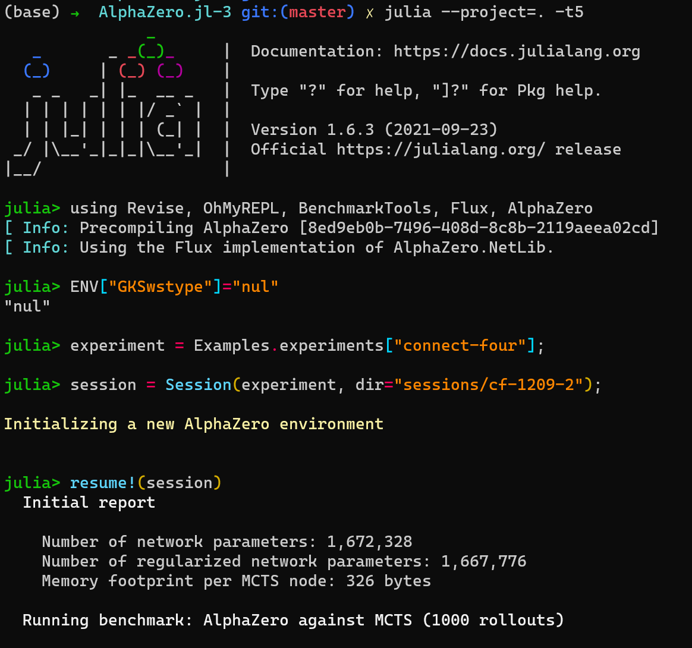

# 自我介绍
谦谦君子，2010 年毕业于北京大学信息管理系；毕业后曾在酷我音乐、人人游戏、腾讯等互联网公司从事 Web 开发及游戏开发；
2019年底加入成都数字天空， 负责组建GameAI团队。

# AlphaZero系列论文发展进程

## AlphaGo
一举成名

## AlphaGoZero
无师自通

## AlphaZero
一招鲜吃遍天

## MuZero
自学环境模型

## EfficientZero
大大提高MuZero的数据效率。

# AlphaZero架构设计

## MCTS

* https://www.youtube.com/watch?v=UXW2yZndl7U
* minmax + 剪枝 + 启发式（专家经验）
* MC + TS
* UCT, Exploration vs Exploitation
* 推理， Policy Improvement
* 系统2

## Deep Neural Network

* Deep, Conv, ResNet
* 直觉， 替代启发式， 专家经验
* 系统1

## 几个版本的区别

* 有无human data
* input是原始数据还是人类设计的特征
* policy & value net统一
* Conv -> ResNet 
* 数据增强
* 不做eval， 直接用最新的model搜集数据

# 开源复现

* ELF
* LeeZero
* KataGo
* 腾讯 https://github.com/Tencent/PhoenixGo
* minigo

# AlphaZero.jl

## 演示使用

* train
* vs Human

## source code讲解

## 添加游戏： 五子棋

## 坑

* ENV["GKSwstype"]="nul"
* 越跑越慢， GC时间占了80%+
* batch_size增大， GPU占用下降. scripts/profile/inference.jl可以推断出最有配置
* threads多了性能反而降低
* 1.7似乎有bug

## TODO

* GUI, vs human, analysis
* GPU 100%利用
* obs预处理转到worker thread, 15%的影响
* 1.7?
* fp16, int8, TensorRT

# EasyZero

* 简洁， 尽可能少的抽象， 尽可能用已有的package
* 只支持一种DL框架， Flux
* 高效， 内存占用GC低， GPU利用率高， batch infer， fp16
* 支持1到多个玩家
* Deploy Http
* GUI(Flutter): vs Human & Analysis, TensorBoard.jl
* 支持多种游戏， 五子棋， 国际象棋， 中国象棋
* 

Maybe
* 多机
* self play和learning异步
* int8, TensorRT, TVM
* KataGo中的优化技巧
* MuZero & EfficientZero
* 更多的网络架构， Transformer
* 超参数自动优化, PBT， Bayes Optimization
* DouZero: MC, 只有Q值， LSTM
* Mahjong
* 可重复, Random.seed!(42)